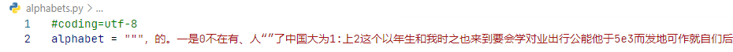

## CRNN的mobilenet实现 旨在构建轻量级文字识别网络

网络的实现参考了 https://github.com/AstarLight/Lets_OCR

cnn部分采用的是mobilenetv3的bneckbone
rnn部分的hidden_unit从原来的256缩减为48（参考百度平台的[ppocr](https://github.com/PaddlePaddle/PaddleOCR)）

## 数据集
初次训练采用的数据集是中文合成数据集，压缩包大小为8.6G，约有360万张，拿到数据集之后使用lmdb将该数据集进行打包处理，以加快训练时的读取速度

alphabet如下:

alphabet为一个python文件，所有的文字信息都存在alphabets.alphabet中(alphabet中需要剔除blank)

数据集图片格式如下：

标签格式如下：

制作数据集需要用到lmdb，在windows系统下使用lmdb会有点不方便，而且windows下lmdb数据集的写入会花费比较多的时间，测试过，linux下十分钟就可以写完，而在windows系统下需要花费4个多小时（当然服务器配置比较高是一个原因，但平台不同的影响也会很大）
如果实在不想制作lmdb数据集，也可将在训练时直接读取（没有测试过效率），修改 lib/dataset.py中的相关内容即可。

训练需要比较久的时间，基本上前面很长一段时间的eval都不会有什么变化，loss也会暂时停滞。

在这之后便会下降

todo：

* 在原先的基础上进行数据增广的操作    done

数据增广方法使用的是 [TIA 的python版本实现](https://github.com/RubanSeven/Text-Image-Augmentation-python)，该方法可以将图像进行更加灵活的变形。

* 对发票数据集进行训练调优